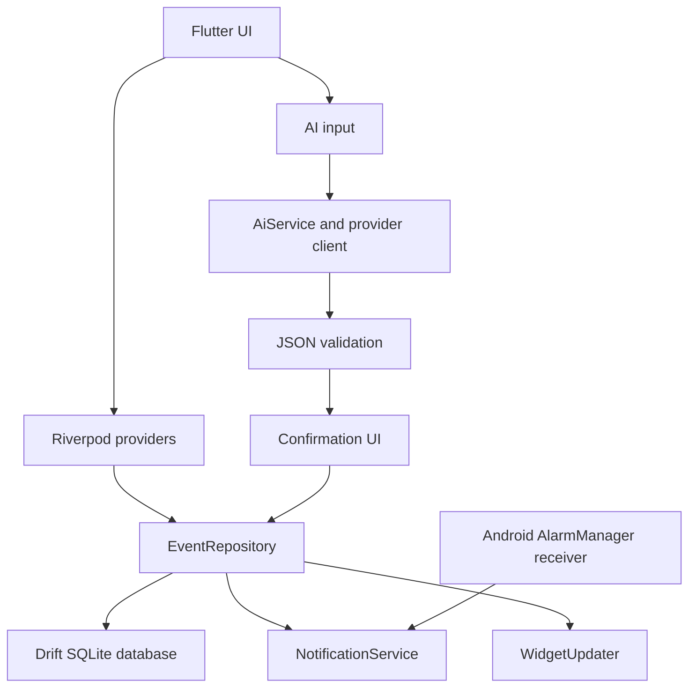

# Architecture

## Runtime flow

The application creates one `AppDatabase` and one `EventRepository` in `main.dart`, then injects them through Riverpod overrides. Manual and AI-approved events both call `EventRepository.save()`. The repository writes the event and reminders, then asks `NotificationService` to schedule operating-system alarms.

## Persistence

Drift stores events, reminders, scheduled notification records, and tasks in the app-private SQLite database. Event timestamps are persisted as UTC epoch milliseconds. The repository converts user-facing local `DateTime` values to UTC on write and reconstructs local values when scheduling and displaying them.

## Notification lifecycle

The notification service initializes timezone data and notification channels before the app starts. It reschedules upcoming events at startup, after the first visible frame, and when the app resumes. Android receivers restore alarms after reboot and package/timezone changes. See [NOTIFICATIONS.md](NOTIFICATIONS.md).

## Boundaries

The AI layer has no database or repository reference. It returns `AiExtractionResult`; the confirmation UI decides what is accepted. The repository is the only event persistence path. Android-specific settings are isolated behind `SystemService` and method channels.

## Known implementation boundaries

The current app is Android-first. AI calls are made directly from the device to the selected endpoint. Recurring events, cloud synchronization, backend key protection, and conversational tool calling are not implemented.

## References

[1]: https://drift.simonbinder.eu/ "Drift documentation"
[2]: https://riverpod.dev/ "Riverpod documentation"
